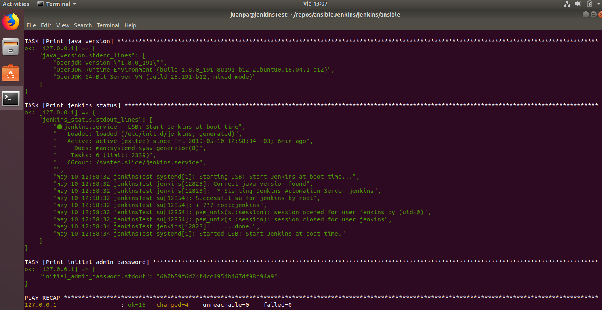
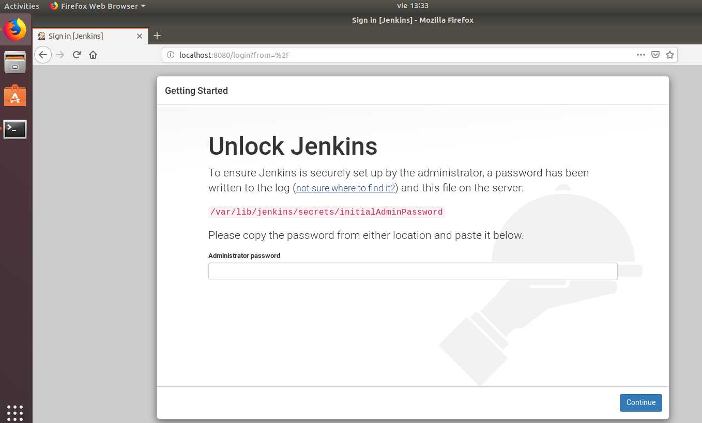
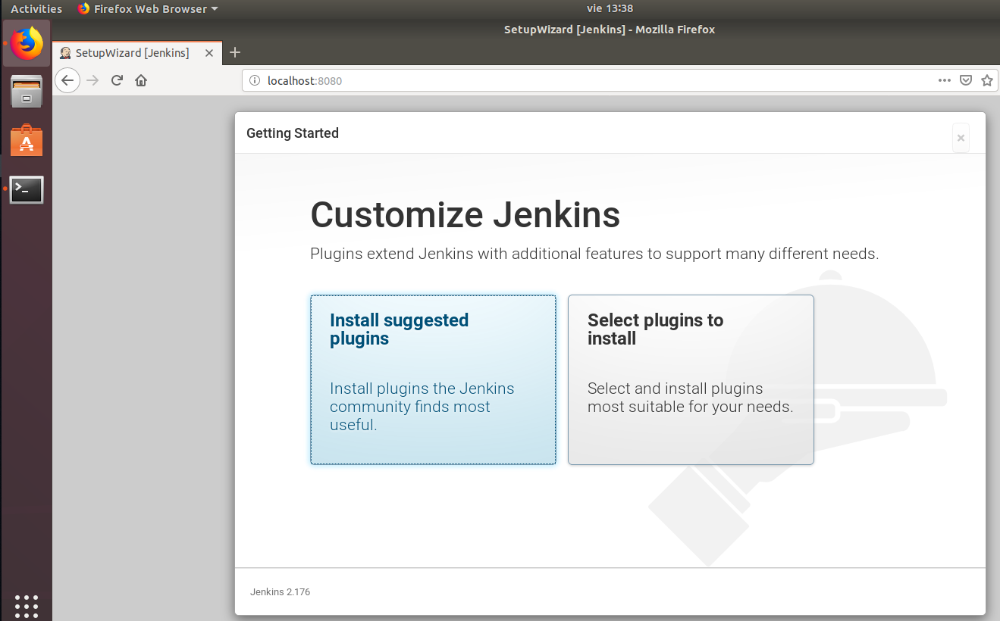
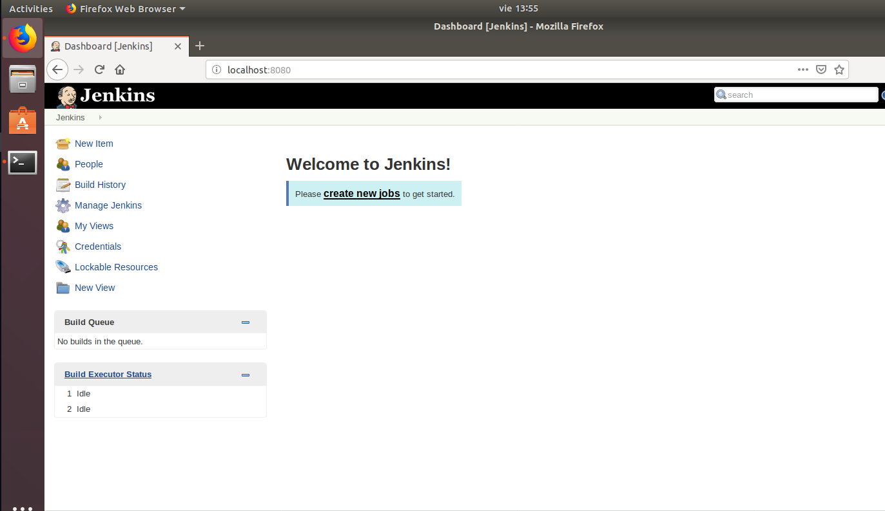
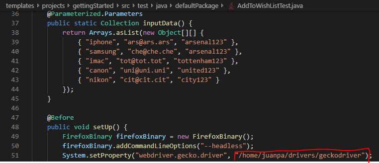
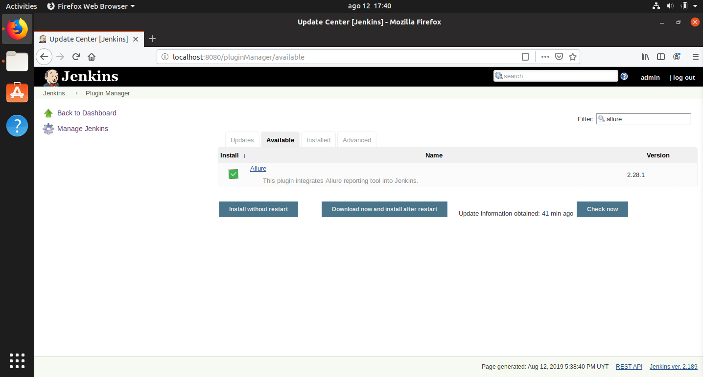
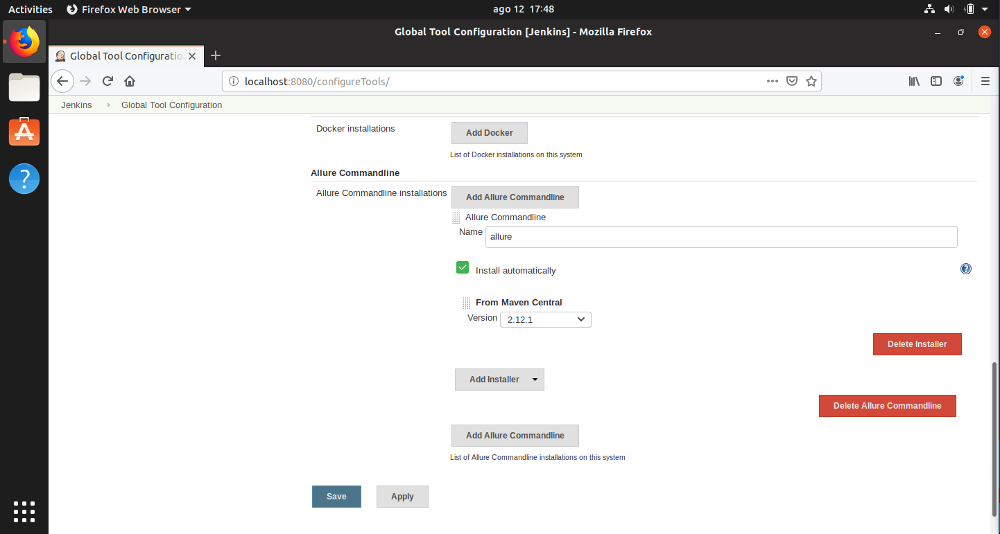
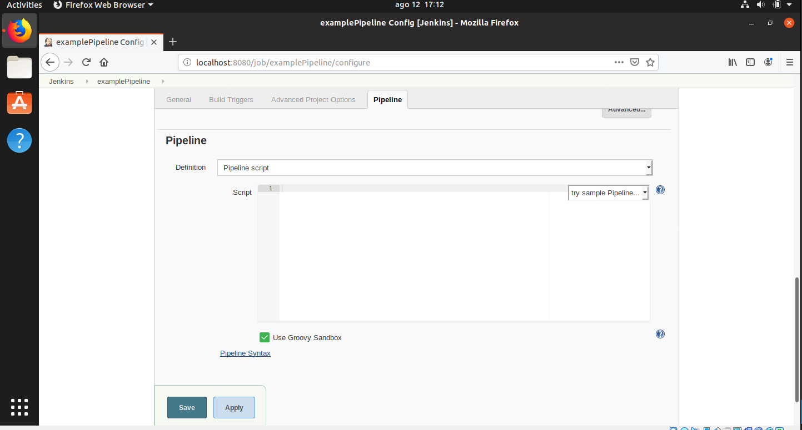

# Installing your first Jenkins server

So, you read the post and wanted to do a little POC to see for yourself how this stack worked together. Here you are gonna learn how!

The only requirement is that the server's distribution is Ubuntu based and that you have ansible previously installed. In case you haven't, you just need to open your terminal and execute the following command:

``` sh
sudo apt install ansible
```

After you have ansible, you need to clone the repository. If you haven't got git installed, now is the time to do it executing this command:

``` sh
sudo apt install git
```

Now we are all set!

Execute the following command in order to clone this repository:

``` sh
git clone https://github.com/abstracta/selenium-jenkins-ansible.git
```

Then, move into the directory which contains the playbooks:

``` sh
cd templates/playbooks
```

And run the playbook with the following command:

``` sh
ansible-playbook installJenkins.yml --ask-become-pass
```

You should see an output similar to the following one:



These messages tell us that java and jenkins were installed correctly, that jenkins is running and also tells us the initial admin password, which we'll need in order to configure our Jenkins instance.

Open the following url http://localhost:8080 locally from your Jenkins server or go to http://$virtualMachineIp:8080 from your own computer.



Now just copy the password that the playbook conveniently shows you, paste it in the field and click on Continue.

You will be presented with this screen:



Since we assume little to no Jenkins experience here, we reccomend installing all suggested plugins, but if you would rather not install bloat that you won't use, you can just select which plugins to install.

After this you will be prompted to create a user, and after you are done with that you will see this screen, which indicates that you are now ready to start doing amazing things with Jenkins!



Once you are done with that, you need to install Maven and Firefox, as well as download the webdriver that Selenium will use.

In order to install Maven and Firefox, you can run this command:

``` sh
sudo apt-get install maven firefox
```

Once you are done with that, head over to [the official geckodriver releases' page](https://github.com/mozilla/geckodriver/releases) and download the latest version. Then extract it to the location of your choice.

After that, open the /templates/projects/gettingStarted folder in a text editor, and modify the setUp method in the test classes in order to point it towards the webdriver you just extracted. The section you have to modify is this one:



Once you are done with that, you are almost ready to start running your tests using Jenkins.

We are going to configure two more things in order to add value to our pipeline: Allure in order to process the generated test results and Extended Email Notification in order to send the execution log automatically.

First, go to http://localhost:8080 if your server has a GUI, otherwise just open http://yourServersIP:8080 on your browser.

### Installing and configuring Allure

Head over to Manage Jenkins -> Manage Plugins, go to the *Available* tab and put allure inside the *Filter* field. Check the box next to the Allure plugin and click on the *Install without restart* button.



Once you are done installing Allure, head over to Manage Jenkins -> Global Tool Configuration, scroll until you see the *Allure Commandline* section, click on *Add Allure Commandline* and configure it as it shows in the following image:



Next, click on the *Save* button and you're good to go. Now we have to configure email notifications.

### Configuring email notifications

We have a section on this already inside the repo: [Sending emails with Jenkins](../how-tos/sendingMails/sendingMails.md)

### Configuring the pipeline

Head over to http://localhost:8080 if your server has a GUI, otherwise just open http://yourServersIP:8080 on your browser, and click on the New Item button on the upper left side of your Jenkins' homepage.

Choose the pipeline option, choose a name for it and scroll down until you see this:



Put this snippet there, changing the variables as needed:

``` groovy
node {

    try{

        stage('Copy repository maven project to workspace') {
            sh 'cp $routeToRepository/templates/projects/gettingStarted/* ./'
        }

        stage('Run maven tests') {
            sh 'mvn clean test'
        }

    } catch (e) {
        
        throw e

    } finally {

        stage('Generate Allure report') {
            allure includeProperties: false, jdk: '', properties: [], reportBuildPolicy: 'ALWAYS', results: [[path: 'target/allure-results']]
        }

        stage('Send email notifications') {
            emailext attachLog: true,
            body: '''Job ${JOB_NAME} build ${BUILD_NUMBER}
                    More info at: http://yourJenkinsIp:8080/job/yourPipelineName/${BUILD_NUMBER} .
                    Access the Allure report at: http://yourJenkinsIp:8080/job/yourPipelineName/${BUILD_NUMBER}/allure''',
            subject: 'Pipeline notifications',
            to: 'your@email.here,your.other@email.here'
        }
        
    }

}

```

Once you've done that, click the *Save* button and click on *Build Now*.

Now sit back and watch your first Jenkins pipeline come to life!

It will run the tests we provided and create an allure report containing the results which can be viewed in the url that will be notified via mail.