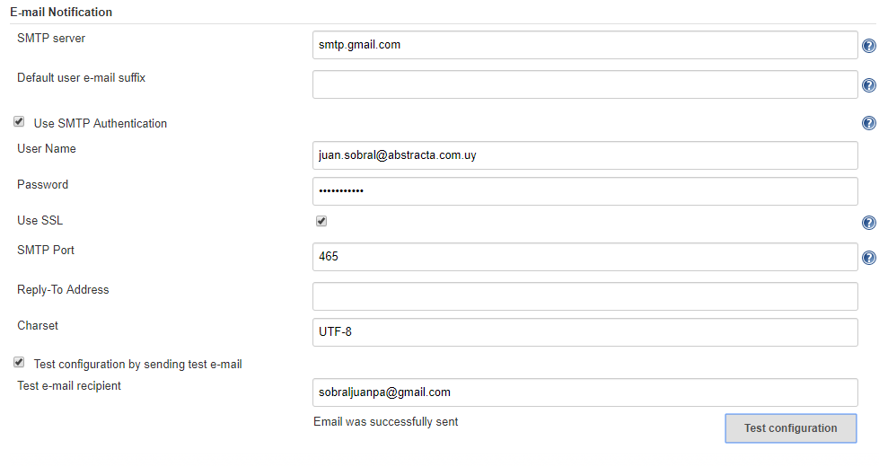
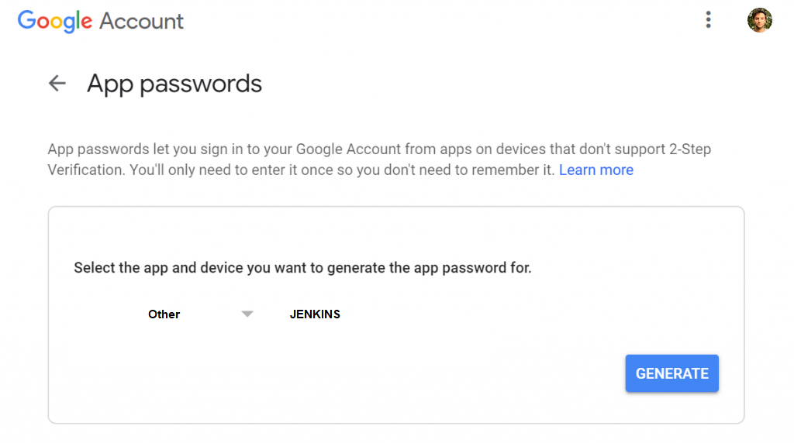
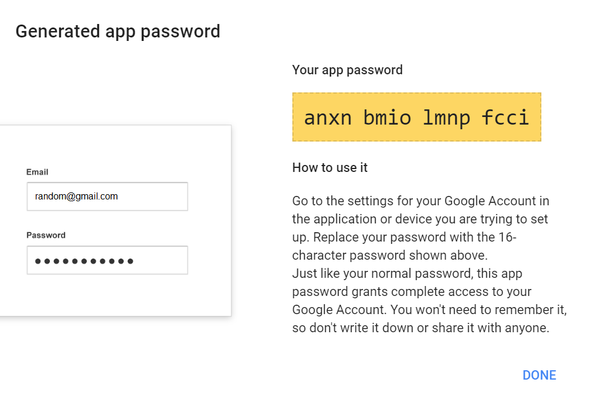
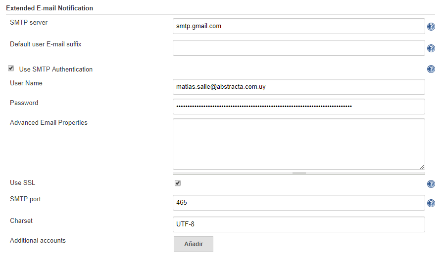
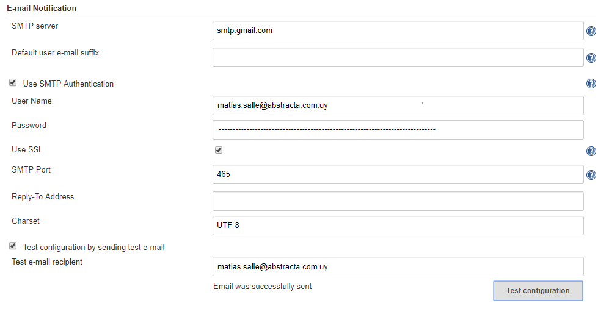
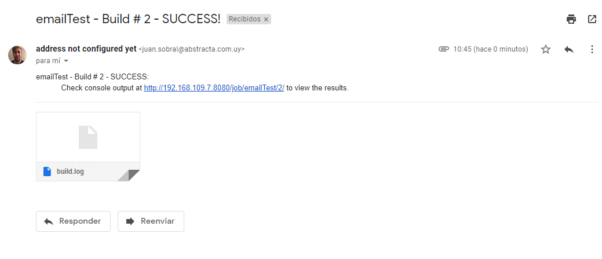
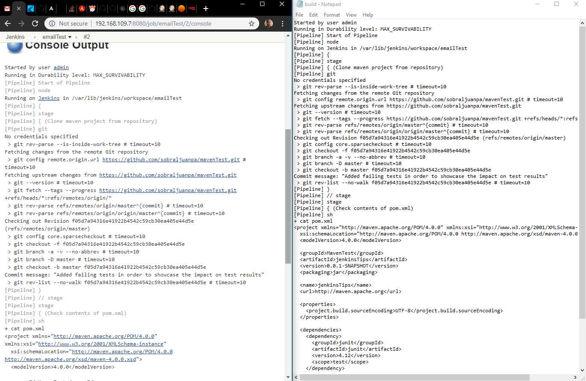

# Sending emails using Jenkins

All of the stuff that gets automated with Jenkins is amazing, but if it has no visibility it is worth a lot less. That's why now we are going to learn how to notify interested parts via email.

## Configuring the SMTP server

In order to send emails, we need to use a SMTP(Simple Mail Transfer Protocol) server, which offers that specialized service.

First, we need to figure out wether we are going to use an email service (eg: GMail) provider's SMTP server or if we are going to configure our own. After this is settled, we have to configure Jenkins in order to use this SMTP server.

Go to Manage Jenkins -> Configure System and scroll down to the Extended E-Mail notification section. We use this plugin, but you can use another one if you feel like it better suits your needs.

One thing that the default email notification plugin has(not extended email notification plugin, just email notification) is the posibility of sending a test email using the configuration you input into it, which comes in really handy to test wether that part works before building a pipeline which sends emails and trying to figure out where the error is.



This is what our configuration looks like, as you can see we tested that the config is correct before trying to use it inside a pipeline. If you are using gmail's smtp service, you will have to enable insecure applications(your jenkins server qualifies as one) to send emails using your credentials. This can be checked by just going into your inbox and following the instructions they will send you in an email if jenkins tells you that it failed to send the test email.

For this demo we are still going to use extended email notification since it provides some interesting functionality by default.
We just need to configure that plugin exactly the same as we configured the email notification one.

## Configuring the SMTP server - Posssible issues 

If after configuring our Gmail account we get the following error message.

``` groovy
Started by user admin
Building in workspace /Users/matiassalle/Jenkins/libs/workspace/
No emails were triggered.
Email was triggered for: Always
Sending email for trigger: Always
Sending email to: (redacted)
Connection error sending email, retrying once more in 10 seconds...
Connection error sending email, retrying once more in 10 seconds...
Failed after second try sending email
Finished: SUCCESS 
```

If we also try to send an email manually through the configuration test and we are getting an authentication error, follow the fix below. 

## Solution

We are going to need two basic things in order solve this problem, 

1. Gmail account with 2-FA in order to get **Application Passwords**
2. Set up Extended E-mail Notification and Email Notification 

### 1. How to Create an Application Password for Gmail

An Application Password is a 16-digit passcode that gives an app or device restricted access to your Google Account without having to divulge your personal password and complete access to your Google Account.

**Note: You must have 2-Step-Authentication enabled before you can set up an Application Password.**

1. Visit your App [Application Passwords page](https://accounts.google.com/signin/v2/sl/pwd?service=accountsettings&passive=1209600&osid=1&continue=https%3A%2F%2Fmyaccount.google.com%2Fapppasswords&followup=https%3A%2F%2Fmyaccount.google.com%2Fapppasswords&rart=ANgoxcfNkKd_n6K3Wak0BVyYytSqhVI8cbme1BlIXFL_sla2GQpKqs_PJ5us5rN8QibsKbT18Kwsj0FaIyeh0yS9Uwxf5pJaTg&authuser=0&csig=AF-SEnZ77v6YIdvhCCf-%3A1565639779&flowName=GlifWebSignIn&flowEntry=ServiceLogin). You may be asked to sign in to your Google Account.
2. At the bottom, click **'Select app'**, choose **'Other'** and enter your own custom app name (e.g **JENKINS**).
3. Click Select device and choose the device you’re using. You can also select **'Other'** and enter you own custom device name.
4. Click on Generate.
5. Follow the instructions to enter the App password (the 16 character code in the yellow bar) on your device (as you can see at the below image).
6. Select Done.







### 2. Setting up Extended E-mail Notification and Email Notification

1. Go to **Manage Jenkins**
2. System Configuration 
3. Extended E-mail Notification and Email notification: We must to set up both places as we did on the previous step [**Configuring the SMTP server**](#configuring-the-smtp-server) with our new application password which we have just generated in Gmail.

It should look like the following example, 






## Setting up a pipeline that notifies via email

Now we are going to create a pipeline that clones the maven repository we used in the run tests with maven section, and lists the current directory's contents, sending the execution log via email as an attachment and providing a link to the execution.

``` groovy

node {

    try{
  
        stage('Clone maven project from repository') {
            git credentialsId: 'githubCredentials', url: 'https://github.com/sobraljuanpa/mavenTest.git'
        }

        stage('Check contents of pom.xml') {
            sh 'cat pom.xml'
        }

    } catch(Exception e) {

        throw e

    } finally {

        stage('Notify results') {
            emailext attachLog: true, body: '''$PROJECT_NAME - Build # $BUILD_NUMBER - $BUILD_STATUS:
            Check console output at $BUILD_URL to view the results.''', 
            subject: '$PROJECT_NAME - Build # $BUILD_NUMBER - $BUILD_STATUS!', 
            to: 'juan.sobral@abstracta.com.uy'
        }

    }

}

```

After two executions, I got this email in my inbox:



And this is how the log looks, side by side with the execution log:


