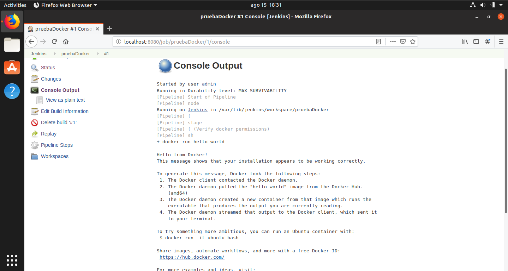

# Using Zalenium to run Selenium tests

## Installing Docker

In order to use Zalenium, we are going to need to have Docker installed in our system first. We are going to give you easy to follow instructions here, but you can always follow the [official documentation](https://docs.docker.com/install/linux/docker-ce/ubuntu/). As usual, these instructions are for Ubuntu based distributions.

First, we need to install some packages to allow ```apt``` to use repositories over HTTPS:

``` sh
$ sudo apt-get install apt-transport-https ca-certificates curl gnupg-agent software-properties-common
```

Then we add Docker's GPG key:

``` sh
$ curl -fsSL https://download.docker.com/linux/ubuntu/gpg | sudo apt-key add -
```

Now we have to set up the stable repository:

``` sh
$ sudo add-apt-repository "deb [arch=amd64] https://download.docker.com/linux/ubuntu $(lsb_release -cs) stable"
```

Now we have to install Docker Engine's Community version

``` sh
$ sudo apt-get update && sudo apt-get install docker-ce docker-ce-cli containerd.io
```

Now to check that the installation was successful, run this command:

``` sh
$ sudo docker run hello-world
```

If the installation was succesful, you should see output similar to this:


Once you have installed Docker, you need to give Jenkins permission to use it.

First, we need to create a Docker user group:

``` sh
$ sudo groupadd docker
```

Then we need to add jenkins user to the docker group:

``` sh
$ sudo usermod -aG docker jenkins
```

Then restart your Jenkins server and create a pipeline with the following code:

``` groovy
node {

    stage('Verify docker permissions') {
        sh 'docker run hello-world'
    }

}
```

Run it, and if everything went well you should see output similar to this:



Now we are ready almost ready to start using zalenium [Zalenium](https://github.com/zalando/zalenium).

The only thing missing is installing docker-compose which we will use to manage our Zalenium containers. As with the Docker installation section, you can either follow the [official documentation](https://docs.docker.com/compose/install/) or this guide which is based on it.

First run this command in order to download Docker Compose

``` sh
$ sudo curl -L "https://github.com/docker/compose/releases/download/1.24.1/docker-compose-$(uname -s)-$(uname -m)" -o /usr/local/bin/docker-compose
```

Then apply execution permissions to the binary

``` sh
$ sudo chmod +x /usr/local/bin/docker-compose
```

In order to test that docker-compose was properly installed, run this command:

```sh
$ docker-compose -version
```

If everything was properly installed, you can move on!

## Zalenium

There are mostly two ways to work with Zalenium: having a running grid all the time or dynamically setting it up inside a pipeline, running your tests and then tearing it down. We are going to show you how to do the second.

First, take a look at the file **docker-compose.yml** located in templates/projects/gettingStarted. It describes the environment you are going to deploy: a Zalenium node with a max of eight running dockerSelenium slave containers(two are initially deployed).

In order to use Zalenium, we will need to have a docker-selenium image locally available. You can get it by running the following command:

```sh
$ docker pull elgalu/selenium
```

After that, you should cd into the /templates/projects/gettingStarted folder and run this command in order to set the grid up:

```sh
$ docker-compose up
```

and the output should be something like this:


Now you have checked that your zalenium setup is working.

## Using Zalenium inside a pipeline

Now we are going to have to modify our tests in order to run them using grid